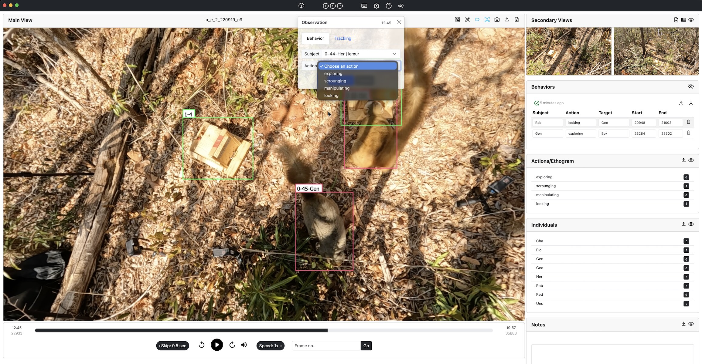
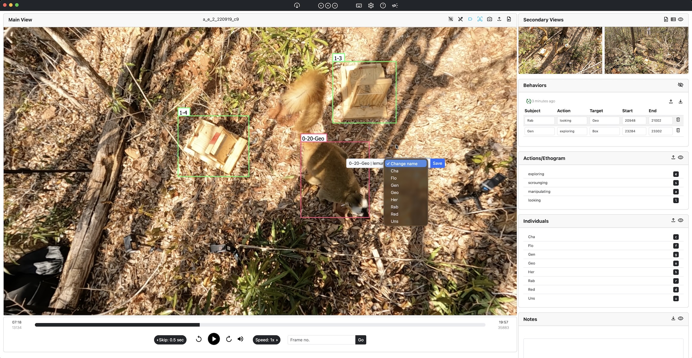
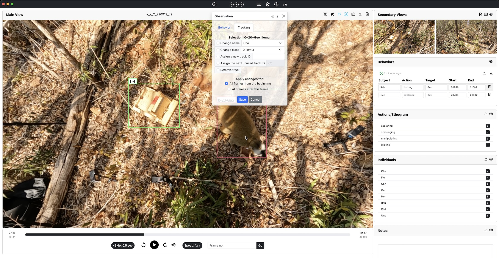

# SiLVi: Simple Interface for Labelling Video Interactions

SiLVi (**S**imple **I**nterface for **L**abelling **V**ideo **I**nteractions) is a lightweight, open-source tool designed specifically to facilitate the annotation of interactions in a way that is both spatially and temporally localized, enabling the generation of training data for computer vision models. 

By supporting precise annotations of both actions and interactions across individuals, SiLVi empowers researchers to move beyond individual-centric behavioral models toward richer representations of social behavior. Apart from this main contribution, SiLVi also allows for labeling individual IDs and annotating or correcting tracks.

You can read the documentation [here](https://ozan-kanbertay.github.io/SiLVi/).

If you use SiLVi in your research, please cite it: https://doi.org/10.48550/arXiv.2511.03819.

