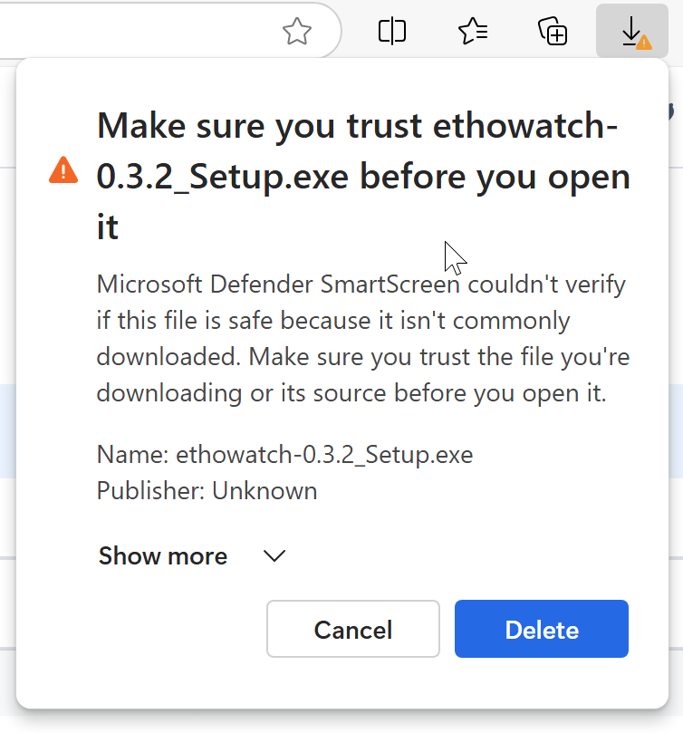
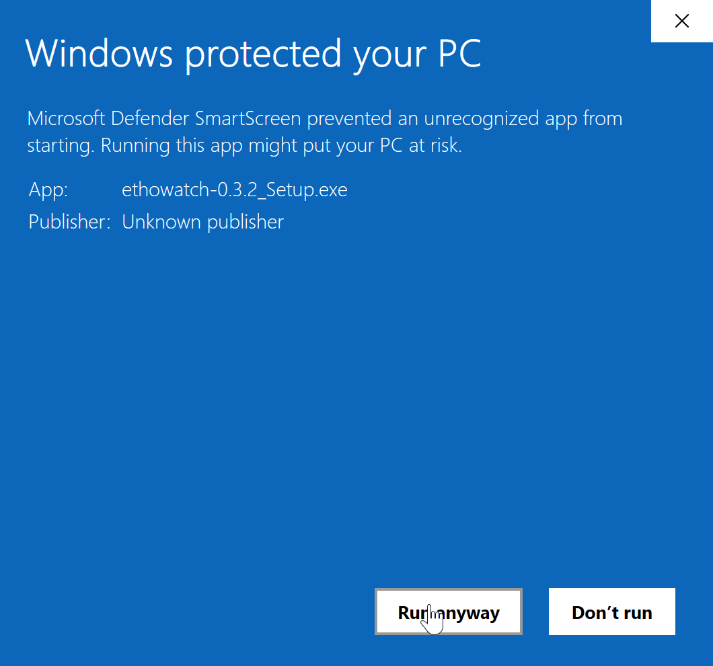

# SILVI: Simple Interface for Labelling Video Interactions
SILVI (**S**imple **I**nterface for **L**abelling **V**ideo **I**nteractions) is a lightweight, open-source tool designed specifically to facilitate the annotation of interactions in a way that is both spatially and temporally localized, enabling the generation of training data for computer vision models. 

By supporting precise annotations of both actions and interactions across individuals, SILVI empowers researchers to move beyond individual-centric behavioral models toward richer representations of social behavior. Apart from this main contribution, SILVI also allows for labeling individual IDs and annotating or correcting tracks.

If you use SILVI in your research, please cite it: https://doi.org/10.48550/arXiv.2511.03819

## Installation
Download the relevant installer for your operation system [here](./installers/).

### MacOS
MacOS [installers](./installers/macOS/) are code signed. The installation and automatic updates should work without an issue. If you own a MacBook based on ARM architecture (M1 or later), download the installer ending with "arm64" in its names. For older Macs using Intel processor, choose the installer with "x64" in its name.

### Windows
There are two ways to use the app on Windows, either via the Microsoft Store or by downloading the executable [directly](./installers/Windows/). Both versions are functionally identical.

It might take up to a few days to get the updates on the Microsoft Store because of the additional verification process done by Microsoft. The EXE version gets the updates within minutes.

#### Microsoft Store Version
The app is in the testing phase and thus not open to the public yet in the Microsoft Store. To use this version, testers of the app need to be added manually. If you want to be one of the testers, please contact us. An email address associated with a Microsoft account with which you can log in to the Microsoft Store is needed. After this step, you will be able to download the app via the following link:

[ms-windows-store://pdp/?productid=9PC1BT8B9TW3](ms-windows-store://pdp/?productid=9PC1BT8B9TW3)

#### EXE Version
On Windows, any app outside the Microsoft Store needs to be code-signed to be marked safe by the operating system. Unfortunately, certificate authorities only issue these code-signing certificates to registered companies. Therefore, for the first installation, permission to run the app must be granted by the user. 

Please follow the instructions below for the installation of the app on Windows. These steps need to be done only once. Each subsequent update will be downloaded and installed by the app automatically.

<div align="center">


On your browser, click the three dots next to the downloaded file and select *Keep*.



Click *Show more*.


Select *Keep anyway*.


Click *More info* on the Microsoft Defender SmartScreen prompt.



Finally select *Run anyway*.

</div>

### Linux
For Ubuntu and other Debian-based Linux distributions, download the deb file compatible with your computer architecture [here](./installers/Linux). Run `arch` or `uname -m` to confirm your architecture. If it outputs `x86_64`, choose the installer with "amd64" in it. Otherwise, download the installer with "arm64" in its name.

On Ubuntu, if GNOME Software has already been installed, you can simply double click on the file to install it. Alternatively, you can execute the following command:

```sudo apt install $PATH_TO_DEB_FILE```

To uninstall the app, execute:

```sudo apt remove ethowatch```

The Linux version has been briefly tested only on Ubuntu 24.04 LTS thus far.

## Usage
First, upload the files for actions and individuals [in the required format](#file-formats). You can download the example files [here](./examples/examples.zip).

After you upload a file, a keyboard shortcut will be generated automatically for each item in the file. You can also change these shortcuts later.

### Recording Behaviors/Observations
To start recording behaviors with keyboard shortcuts, first activate the labeling mode. You can do this either by toggling the relevant button on the main view panel or by pressing the assigned shortcut. When you are typing, the labeling is disabled automatically to prevent any clashes with the shortcuts.

Each observation of a behavior consists of a subject, an action and optionally a target. 

The frame in which you press the shortcut for a subject will be recorded as the start frame. Similarly, the frame in which you press the shortcut assigned to a target or ending an observation without a target will be recorded as the end frame.

There are three ways to record a behavior.

#### 1. Behaviors with a target
- Go to the start frame of the behavior 
- Press the shortcut assigned to the subject of the behavior 
- Press the shortcut assigned to the action of the behavior
- Go to the end frame of the behavior 
- Press the shortcut assigned to the target of the behavior (either a box or one of the individuals)

#### 2. Behaviors without a target
There are two ways to record a behavior without a target.

##### 2.1. Single behavior without a target
- Go to the start frame of the behavior 
- Press the shortcut assigned to the subject of the behavior 
- Press the shortcut assigned to the action of the behavior
- Go to the end frame of the behavior
- Press the shortcut assigned to ending the current observation

##### 2.2. Consecutive behaviors with the same subject
- Go to the start frame of the first behavior
- Press the shortcut assigned to the subject of the first behavior
- Press the shortcut assigned to the action of the first behavior
- Go to the end frame of the first behavior (this will also be the start frame of the second behavior)
- Press the shortcut assigned to the action of the next behavior

The first behavior will be recorded without a target.

The frame in which you pressed the shortcut for the second action will be recorded as the end frame of the first behavior. This frame will also be recorded as the start frame of the second behavior. Now, the app will wait for you to select a target for the second observation or ending the observation without a target. You should then go to the frame where the second behavior ends and press the shortcut assigned to your selection for the target.

### Identifying Subjects/Individuals

Right click on a bounding box over the main video, select an individual's name, and then click **Save**.

## Zooming Into the Main View
You can zoom into a specific region of the main view.

First, enable the zoom mode. Then, hold down your mouse over the main view and draw a rectangle to zoom in on a specific area. Release the mouse to view the zoomed area in a new window.

Adjust the zoom scale on this window or use the settings menu. The window for zoomed area can be moved and hidden freely.

## File Formats
To start labeling behaviors, text files for action types, modifiers and individual names must be uploaded first. Each item in these files must be separated with a comma. For consistency, please do not put a space within an item. For example, if an item in the action list describes a "successful push", write down either "successful_push" or "SuccessfulPush". Other than this, there is no restriction on the names.

## Saving Your Work
Last opened main view, secondary views and video timestamp are saved automatically. They will be reloaded when you relaunch the app. 

Your observations, tracking edits and notes linked to the main view are always saved automatically. When you open a new video as the main view with any previous work linked to it, the app will import them. For example, you were working on Video A, then opened Video B before completing your work on the Video A. You worked a bit on Video B, then resumed your work on Video A. All your work linked to Video A (behaviors, tracking edits, notes, etc.) will be reimported. This is also true when you reopen the Video B.

When you relaunch the app, it will import all your previous work linked to the last opened main view.

You can export all files linked to the main view whenever you prefer. The files will be exported into a folder named after the main view. The app will keep your work even after you export these files. 

## Clearing App Data
If necessary, you can clear the app data via the *Settings* button. This can be useful as a last resort solution if you encounter any issues that cannot be resolved by any other way. However, **clearing the app data will result in losing all unexported work**. Please export your work before using this option.

<!-- ## Usage
First, upload files for action types, modifiers and individual names [in the required format](#file-formats). You can download the example files [here](./examples/examples.zip).

After you upload each file, keyboard shortcuts for each item will be generated automatically. You can view the shortcuts on their corresponding panels.

### Activating the labeling shortcuts
To start labeling behaviors with keyboard shortcuts, first activate the labeling mode. You can do this either by toggling the relevant button on the main view panel or by pressing the relevant shortcut. At each step, a small notification box will appear to confirm your choice and inform you about the next step.

The keyboard shortcuts are case-sensitive. For example, to use the shortcut listed as `S`, press `Shift` and `s`.

### Starting a new record
Go to start frame of the behavior and press `S` to mark the start. You should already see that a new row is created on the behavior table.

### Subject selection
Next, choose the subject of the behavior by pressing the relevant shortcut. The shortcuts for individuals are listed on the *Individuals* panel. If the selected individual is detected by our model, it will be highlighted on the current video frame.

### Action selection
Next, choose the action by pressing the relevant shortcut. The shortcuts for action types are listed on the *Actions* panel.

### Target selection
For target selection, you have three options:
- Skip it if there is no target for the selected action by pressing `N`.
- Choose a box as the target by pressing `B`.
- Choose another individual as the target with the same steps outlined in the subject selection

### Modifier selection
You can view the shortcuts for modifiers on the *Modifiers* panel. Press the relevant shortcut to choose a modifier. If there is no modifier for this behavior, skip it with `N`.

### Ending the current record
Go to the frame where the current behavior ends. Use the right arrow to go forward by one frame and the left arrow to go back by one frame if necessary. Press `E` to mark the end. You should now see an notification on successful addition of this behavior. The video will jump back automatically to the frame where the behavior just annotated started. 

## Exporting your records
By default, the app saves the session data automatically when you quit the app. Normally, it should resume your session when you open it again later. However, to permanently save your records, use the *download* button on the behavior table to export your observations to a CSV file.

## Interactive tracking boxes
If you upload a tracking file, you can also record your observations by clicking on the bounding boxes. Track IDs will be recorded for each subject and target instead of their individual names.

## File formats
To start labeling behaviors, text files for action types, modifiers and individual names must be uploaded first. Each item in these files must be separated with a comma. For consistency, please do not put a space within an item. For example, if an item in the modifier list describes a "successful push", write down either "successful_push" or "SuccessfulPush". Other than this, there is no restriction on the item names.

## Clearing app data
If necessary, you can clear the app data via the *settings* button. This can be useful if you encounter any issues which could not be solved by restarting the app. -->